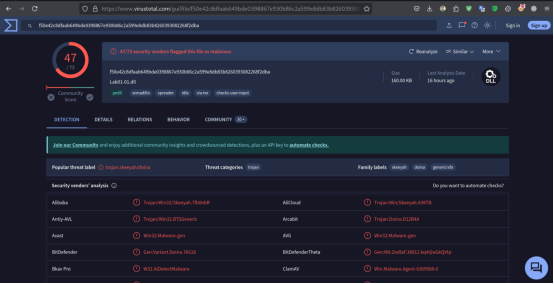
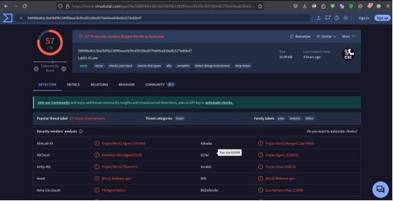
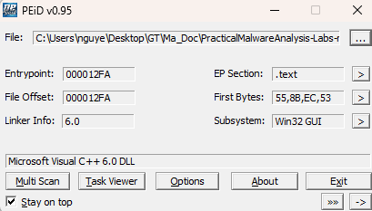
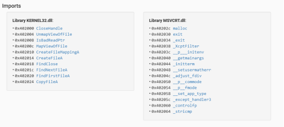
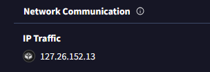
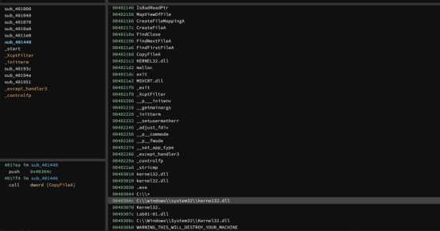

# **Lab 1-1**

---

> This lab uses the files Lab01-01.exe and Lab01-01.dll. Use the tools and techniques described in the chapter to gain information about the files and answer the questions below.

---

## **1. Upload the files to <https://www.virustotal.com/> and view the reports. Does either file match any existing antivirus signatures?**

---

Upload 2 file lên virustotal check thấy đa số kết quả chỉ ra 2 file là trojan.

---

### **2. When were these files compiled?**

---

Có thể sử dụng virustotal > details:
Cả 2 file đều được compile vào 19/12/2010.  

---

## **3. Are there any indications that either of these files is packed or obfuscated? If so, what are these indicators?**  

---

Sử dụng PEiD để kiểm tra 2 file, không thấy có dấu hiệu cho thấy file packed.  

  

  

---

## **4. Do any imports hint at what this malware does? If so, which imports are they?**  

---

  

Ở file Lab01-01.exe ta thấy có sử dụng thư viện KERNEL32.dll với các hàm đáng chú ý như:  
    - CreateFileA (0x402014): Mở hoặc tạo một tệp với các thuộc tính được chỉ định (phiên bản ANSI).  
    - FindFirstFileA (0x402020): Bắt đầu quá trình tìm kiếm tệp trong một thư mục (phiên bản ANSI).  
    - FindNextFileA (0x40201c): Tìm kiếm tệp tiếp theo trong một thư mục (phiên bản ANSI).  
    - CopyFileA (0x402024): Sao chép một tệp từ vị trí này sang vị trí khác (phiên bản ANSI).  

Các hàm trên cung cấp khả năng thao tác với tệp, có thể giúp mã độc tìm kiếm, tạo các file trong máy tính. Có thể sử dụng để tạo backdoor:  

- **CreateFileA**: Mã độc có thể mở, tạo hoặc ghi đè các tệp tin trên hệ thống. Điều này có thể được sử dụng để:  
  
  - **Ghi đè các tệp hệ thống quan trọng:** Thay thế hoặc ghi đè các tệp hệ điều hành hoặc tệp cấu hình quan trọng, dẫn đến sự cố hệ thống hoặc làm cho hệ thống dễ bị tổn thương hơn trước các cuộc tấn công tiếp theo.  
  - **Tạo các tệp độc hại:** Tạo các tệp chứa mã độc để lây lan hoặc thực thi thêm các hành động độc hại trên hệ thống.  

- **MapViewOfFile**, **CreateFileMappingA**, **UnmapViewOfFile**: Mã độc có thể ánh xạ các tệp tin vào bộ nhớ để thao tác trực tiếp trên chúng. Điều này cho phép mã độc:  

  - **Đọc hoặc sửa đổi nội dung tệp:** Ánh xạ các tệp tin thực thi hoặc tài liệu quan trọng và thay đổi nội dung của chúng, dẫn đến việc tệp tin bị sửa đổi để thực hiện các hành vi độc hại.  
  - **Chỉnh sửa tệp nhị phân:** Thực hiện các chỉnh sửa trên các tệp thực thi để nhúng mã độc vào chúng (ví dụ như trojan hóa một chương trình hợp pháp).

- **FindFirstFileA**, **FindNextFileA**, **FindClose**: Mã độc có thể duyệt qua các thư mục và tìm kiếm các tệp tin cụ thể. Điều này có thể được sử dụng để:  

  - **Tìm kiếm và lây nhiễm các tệp tin khác:** Tìm kiếm các tệp có đuôi cụ thể như .exe, .docx, hoặc .pdf để nhúng mã độc vào chúng.  
  - **Quét và đánh cắp dữ liệu:** Tìm kiếm các tệp chứa dữ liệu nhạy cảm (như tệp mật khẩu, tệp cấu hình, tệp tài liệu quan trọng) để đánh cắp hoặc mã hóa chúng (trong trường hợp ransomware).  

- **CopyFileA**: Mã độc có thể sao chép tệp tin từ vị trí này sang vị trí khác, cho phép:  

  - **Tạo bản sao của mã độc:** Sao chép chính nó hoặc các tệp độc hại khác đến các thư mục quan trọng hoặc khó phát hiện, giúp mã độc lan truyền hoặc tự động khởi chạy lại sau khi hệ thống khởi động lại.  
  - **Sao lưu dữ liệu bị mã hóa:** Trong trường hợp ransomware, mã độc có thể sao lưu các tệp tin trước khi mã hóa, tạo cơ hội đòi tiền chuộc hoặc sử dụng tệp tin đó trong các hoạt động khác.  

- **CloseHandle**: Mã độc có thể đảm bảo rằng các tệp tin và tài nguyên hệ thống được đóng đúng cách sau khi đã thực hiện các hành động độc hại để tránh bị phát hiện hoặc gây ra lỗi bất thường, giúp mã độc hoạt động một cách tinh vi hơn.  

Ngoài ra, ở file Lab01-01.dll ta còn thấy sử dụng các hàm từ thư viện KERNEL32.dll, WS2_32.dll (thư viện liên quan đến mạng trên Windows).  

- **KERNEL32.dll**:  
  
  - **Sleep** (0x10002000): Tạm dừng thực thi của luồng hiện tại trong một khoảng thời gian nhất định (tính bằng mili-giây).  
  - **CreateProcessA** (0x10002004): Tạo và chạy một tiến trình mới (phiên bản ANSI).  
  - **CreateMutexA** (0x10002008): Tạo hoặc mở một đối tượng mutex để đồng bộ hóa truy cập tài nguyên (phiên bản ANSI).  
  - **OpenMutexA** (0x1000200c): Mở một mutex đã tồn tại (phiên bản ANSI).  
  - **CloseHandle** (0x10002010): Đóng một handle tới một đối tượng hệ thống (tệp, tiến trình, mutex, v.v.).  

**CreateProcessA**: Mã độc có thể tạo các tiến trình con độc hại, chẳng hạn như khởi chạy các công cụ tấn công khác hoặc thậm chí sao chép chính nó để chạy dưới nhiều tiến trình, làm phức tạp việc phát hiện và loại bỏ.  
**CreateMutexA**, **OpenMutexA**: Mã độc có thể sử dụng mutex để đảm bảo rằng chỉ một phiên bản của nó đang chạy trên hệ thống, ngăn cản việc nó bị chạy lại nhiều lần và giảm nguy cơ phát hiện bởi hệ thống phòng thủ.  
**Sleep**: Mã độc có thể tạm dừng hoạt động để tránh sự phát hiện của các phần mềm bảo mật. Ví dụ, nó có thể chờ một thời gian dài trước khi bắt đầu thực hiện các hành vi độc hại, nhằm tránh bị phát hiện ngay lập tức khi tệp thực thi.

- **WS2_32.dll** (thư viện liên quan đến mạng trên Windows):  
  - **socket** (0x10002030): Tạo một socket mới dùng cho giao tiếp mạng.  
  - **WSAStartup** (0x10002034): Khởi tạo thư viện Windows Sockets API.  
  - **inet_addr** (0x10002038): Chuyển đổi địa chỉ IPv4 từ chuỗi ASCII thành dạng số (dùng trong socket).  
  - **connect** (0x1000203c): Kết nối socket tới một địa chỉ mạng cụ thể.  
  - **send** (0x10002040): Gửi dữ liệu qua một socket.  
  - **shutdown** (0x10002044): Đóng một kết nối socket một cách trật tự (ngăn chặn việc gửi hoặc nhận dữ liệu).  
  - **recv** (0x10002048): Nhận dữ liệu từ một socket.  
  - **closesocket** (0x1000204c): Đóng một socket.  
  - **WSACleanup** (0x10002050): Giải phóng tài nguyên sử dụng bởi Windows Sockets API.  
  - **htons**: Chuyển đổi byte-order, hỗ trợ tương tác mạng chính xác trên nhiều nền tảng.  

> **socket**, **WSAStartup**, **closesocket**, **WSACleanup**: Tệp thực thi có thể thiết lập và quản lý các kết nối mạng thông qua giao thức socket, khởi tạo và giải phóng tài nguyên liên quan đến mạng.  
>
> **inet_addr**: Chuyển đổi địa chỉ IP từ dạng chuỗi sang dạng số để sử dụng trong kết nối mạng.  
>
> **connect**: Kết nối đến các máy chủ hoặc dịch vụ khác qua mạng.  
>
> **send**, **recv**: Tệp thực thi có thể gửi và nhận dữ liệu qua mạng, cho phép truyền thông giữa các hệ thống, chẳng hạn như giao tiếp với máy chủ từ xa hoặc truyền dữ liệu qua các giao thức TCP/UDP.  
>
> **shutdown**: Đóng kết nối socket, đảm bảo việc dừng truyền nhận dữ liệu đúng cách.  
> **htons**: Chuyển đổi byte-order, hỗ trợ tương tác mạng chính xác trên nhiều nền tảng.  

Và ta thấy file Lab01-01.dll kết nối với một IP `127.26.152.13` rất có thể là IP của C2.  

  

---

## **5. Are there any other files or host-based indicators that you could look for on infected systems?**  

---

Sử dụng công cụ RE Binary Ninja ta thấy có một file dll khả nghi: `kerne132.dll`  

  

Ta tìm thấy có một function sử dụng hàm CopyfileA của thư viện `KERNEL32.dll` để sao chép, ghi đè nội dung file `Lab01-01.dll` lên file `kerne132.dll`.  

  

Điều này đồng nghĩa với việc file Lab01-01.dll (file có khả năng kết nối tới C2) đã được sao chép vào thư mục `C:\\windows\\system32` dưới cái tên mới là `kerne132.dll`.  

---

## **6. What network-based indicators could be used to find this malware on infected machines?**  

---

Như đã phân tích ở trên, file `Lab01-01.dll` sẽ là file backdoor để kết nối tới C2 và nó kết nối tới IP `127.26.152.13`.  

---

## **7. What would you guess is the purpose of these files?**  

---

Qua thông tin tìm được ở trên, có thể đoán được rằng file `Lab01-01.exe` là file sử dụng để cài đặt, import các thư viện cần thiết cho việc đọc, sửa file và ghi file vào hệ thống.  

`Lab01-01.dll` là file backdoor kết nối tới IP `127.26.152.13`(có thể là C2).  
File có hàm sleep import từ KERNEL32.dll có thể giúp nó ngủ đông để tránh bị phát hiện và kích hoạt khi cần.  
Nội dung file sẽ được copy vào file khác là `“C:\\windows\\system32\\kerne132.dll”`  gần giống với file `kernel32.dll` gốc của windows giúp file dễ dàng lẩn tránh và ẩn mình trong hệ thống.  

---

# **References**

---

**Lab01-01.exe:**  
<https://www.virustotal.com/gui/file/58898bd42c5bd3bf9b1389f0eee5b39cd59180e8370eb9ea838a0b327bd6fe47>  
<https://cuckoo.cert.ee/analysis/5208207/summary>  
<https://cloud.binary.ninja/bn/b1ea2638-b0d8-46fd-b21c-8b1b4bfbbf3e>  

**Lab01-01.dll:**  
<https://www.virustotal.com/gui/file/f50e42c8dfaab649bde0398867e930b86c2a599e8db83b8260393082268f2dba>  
<https://cuckoo.cert.ee/analysis/5208209/summary>  
