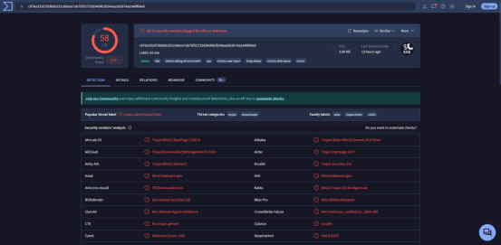
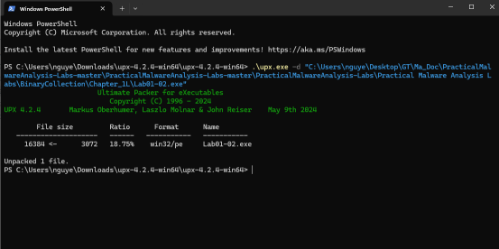
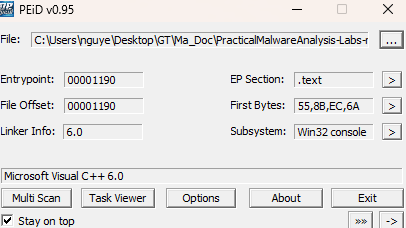
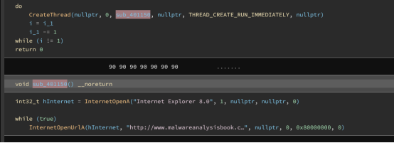
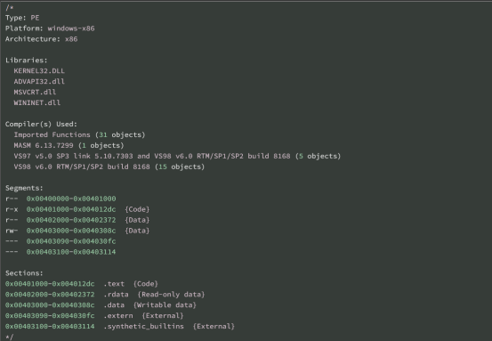
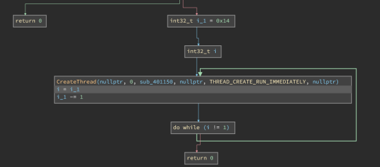

# **Lab 1-2**  

---

## **1. Upload the Lab01-02.exe file to <http://www.VirusTotal.com/>. Does it match any existing antivirus definitions?**  

---

File Lab01-02.exe thuộc phân loại trojan.  

  

---

## **2. Are there any indications that this file is packed or obfuscated? If so, what are these indicators? If the file is packed, unpack it if possible.**  

---

Sử dụng PEiD để kiểm tra ta thấy file được packed bởi:  
`UPX 0.89.6 - 1.02 / 1.05 - 2.90 -> Markus & Laszlo.`  

Sử dụng UPX để unpack:  
  
  

---

## **3. Do any imports hint at this program’s functionality? If so, which imports are they and what do they tell you?**  

---

  

Ta thấy file có import các thư viện như trong hình, đặc biệt có sử dụng 2 hàm InternetOpenA và InternetOpenUrlA.  

> - **InternetOpenA**: Tạo phiên làm việc Internet.  
> - **InternetOpenUrlA**: Truy xuất tài nguyên từ một URL.  

  

Ta thấy được hàm sử dụng InternetOpenUrlA để kết nối tới URL: `http://www.malwareanalysisbook.com`  

  

---

## **4.What host- or network-based indicators could be used to identify this malware on infected machines?**  

---

Khi thực thi, sau khi import các thư viện và hàm cần thiết, chương trình gọi tới hàm dùng func `StartServiceCtrlDispatcherA` - `ADVAPI32.dll` để tạo một service với `lpServiceStartTable = “MalService”`  

  

  

Sau đó gọi tới hàm khác tạo một Service `(CreateServiceA - ADVAPI32.dll)` mới:  

  

- **Tên**: Malservice.  
- **Loại service**: SERVICE_WIN32_OWN_PROCESS - Dịch vụ chạy trong quy trình riêng của nó.  
 Service Start Option: SERVICE_AUTO_START - tự khởi động cùng hệ thống.  
- **SERVICE_ERROR_IGNORE**: Service tiếp tục khởi động nếu gặp lỗi.  
- Trong hàm trên, function `GetModuleFileName` - `KERNEL32.dll` có tác dụng lấy filename hiện tại và gán cho `var_3e8`. Khi service chạy, nó sẽ gọi đến filename này. Nghĩa là service này tạo ra để gọi lại chương trình mã độc mỗi khi khởi động máy.  

Sau khi tạo service, chương trình gọi tới hàm khác để tạo kết nối internet và kết nối tới URL `“http://www.malwareanalysisbook.com”` Qua 2 func `InternetOpenA` & `InternetOpenUrlA` - `WININET.dll`. Chương trình tạo tới 20 luồng để mở kết nối tới URL `(0x14 = 20)`.  

  

**Tổng kết lại**: Chương trình sẽ tạo một service khởi động cùng hệ thống tên là `“Malservice”` có thể khởi động lại cùng hệ thống, giúp duy trì sự hoạt động của mã độc.  
Service có mục đích là gọi lại chương trình mã độc mỗi khi khởi động máy.  
Trong chương trình, hàm thực thi mở backdoor chính là `sub_401150`, được chạy trong 20 luồng và kết nối tới URL: `“http://www.malwareanalysisbook.com”`.  

---

# **References**

---
RE:  
<https://cloud.binary.ninja/bn/e440f6fd-d061-49a5-94e9-10f47469e974?view=Disassembly&il=3&func=4198800>  

Virustotal:  
<https://www.virustotal.com/gui/file/8bcbe24949951d8aae6018b87b5ca799efe47aeb623e6e5d3665814c6d59aeae/behavior>  

Cuckoo.cert  
<https://cuckoo.cert.ee/analysis/5208604/static/>  

app.any.run  
<https://app.any.run/tasks/7c601446-8988-46e0-923a-50c1a671cace?p=66e8eb955a7d74e5066bc5ca>  
