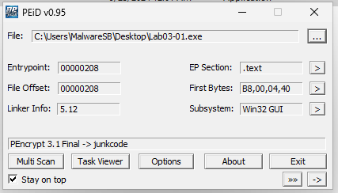
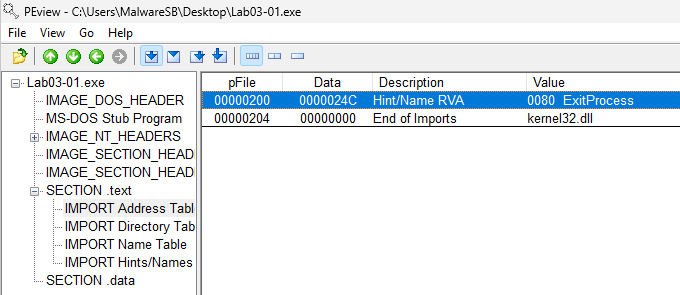
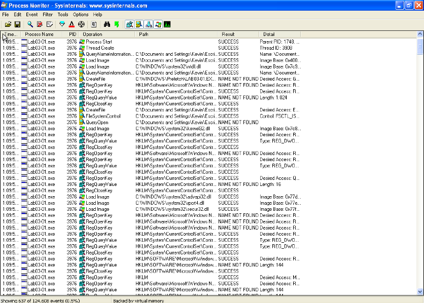
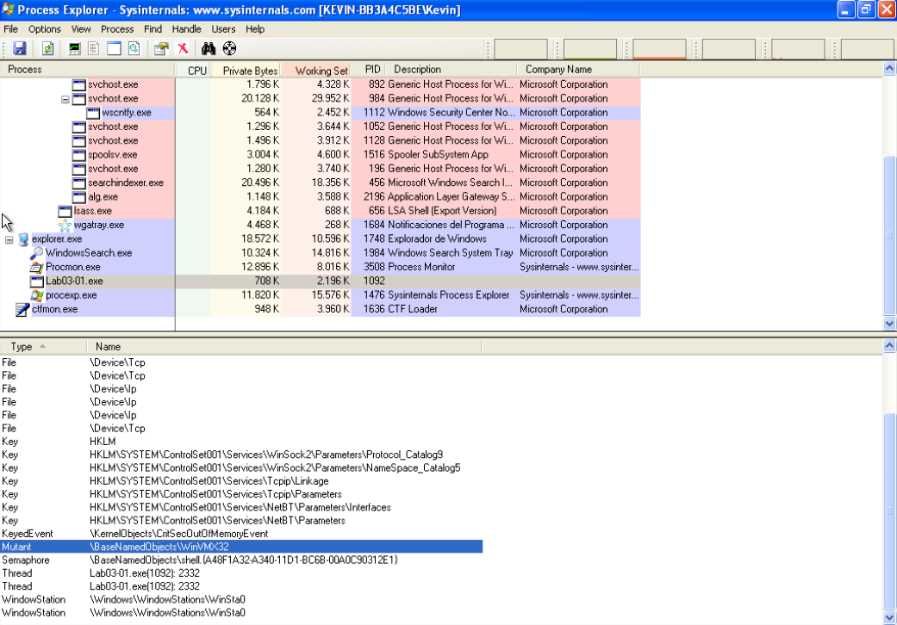
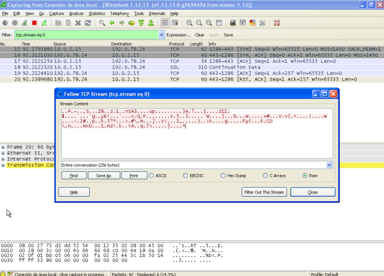

# **Lab 3-1**  

---

## **1. What are this malware’s imports and strings?**  

---

Sử dụng PEiD để kiểm tra nhận thấy có vẻ file Lab03-01.exe đã packed.  

  

Kiểm tra string và các lib import thì chỉ thấy file import func `ExitProcess` - `kernel32.dll`.  

  

---

## **2. What are the malware’s host-based indicators?**  

---

Bật `procmon` và chạy chương trình `Lab03-01.exe`.  

  

Sử dụng filter lọc giá trị `WriteFile` và `RegSetValue`:  

  

Phần mềm độc hại tạo một tệp: `C:\Windows\system32\vmx32to64.exe` và duy trì sự tồn tại bằng cách tạo một registry thực thi tệp này khi khởi động. Tệp `vmx32to64.exe` là bản sao của `Lab03-01.exe`.  

Ngoài ra, Phần mềm độc hại còn tạo một mutex có tên `WinVMX32`:  

  

  

---

## **3. Are there any useful network-based signatures for this malware? If so, what are they?**  

---

Malware đã resolve `http://www.practicalmalwareanalysis.com/`  

  

Sau khi phần mềm độc hại phân giải tên, nó liên tục gửi 256 byte dữ liệu không thể đọc được đến máy chủ (có thể được mã hóa):  

  
