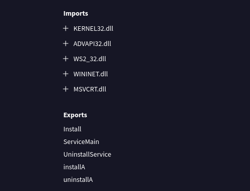
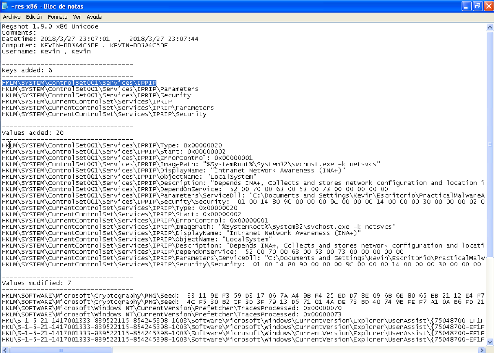
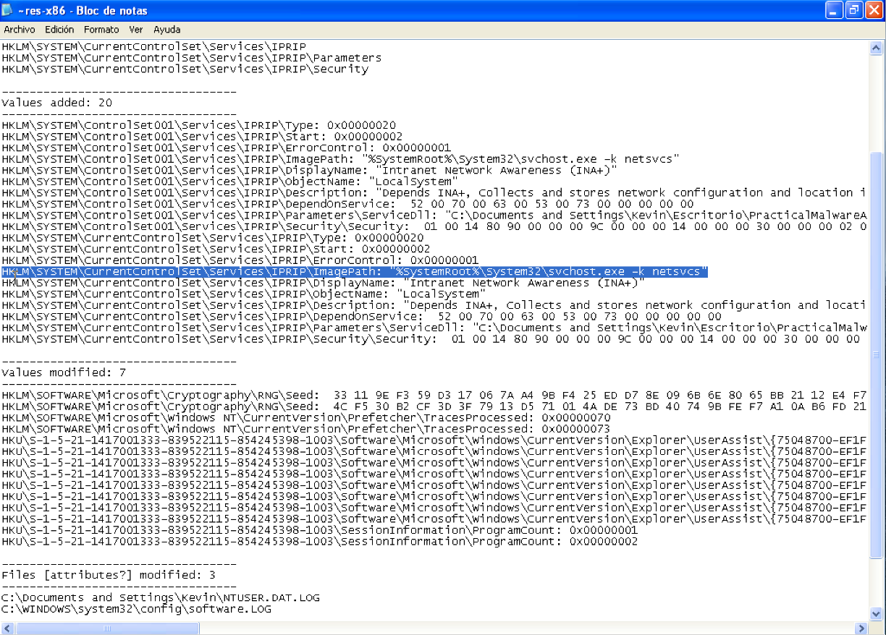
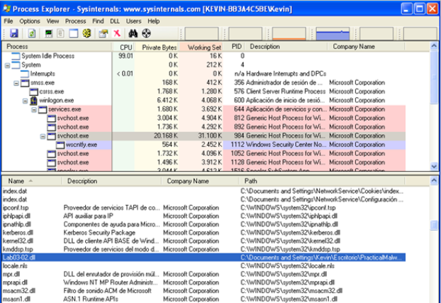
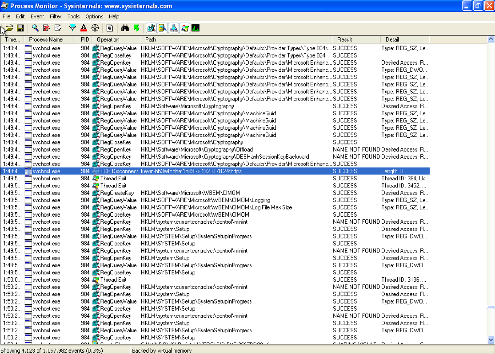

# **Lab 3-2**  

---

## **1. How can you get this malware to install itself?**  

---

Ta thấy chương trình import và export một số thư viện, function:

  

Để chạy file cần sử dụng:

```batch
rundll32.exe Lab03-02.dll, installA
```

---

## **2. How would you get this malware to run after installation?**  

---

  

Phần mềm độc hại tạo ra một dịch vụ có tên IPRIP. Có thể bắt đầu dịch vụ này bằng lệnh sau:

```batch
net start IPRIP
```

---

## **3. How can you find the process under which this malware is running?**  

---

Trong đầu ra của RegShot, chúng ta có thể thấy rằng tiến trình sẽ chạy Phần mềm độc hại là svchost.exe.  

  

Do đó, với Process Explorer, chúng ta có thể kiểm tra phiên bản `svchost.exe` nào đã tải `Lab03-02.dll`. Và đó là process với PID `984`.  

  

---

## **4. Which filters could you set in order to use procmon to glean information?**  

---

Vì có nhiều phiên bản svchost.exe đang chạy trên hệ thống nên cách tốt nhất để lọc thông tin không mong muốn là tạo bộ lọc bằng PID, trong trường hợp này là giá trị `984`.  

  

---

## **5. What are the malware’s host-based indicators?**  

---

Phần mềm độc hại tạo ra một service có tên IPRIP.  
Các registry keys sau đã được thêm vào:  

- HKLM\SYSTEM\ControlSet001\Services\IPRIP
- HKLM\SYSTEM\ControlSet001\Services\IPRIP\Parameters
- HKLM\SYSTEM\ControlSet001\Services\IPRIP\Security
- HKLM\SYSTEM\CurrentControlSet\Services\IPRIP
- HKLM\SYSTEM\CurrentControlSet\Services\IPRIP\Parameters
- HKLM\SYSTEM\CurrentControlSet\Services\IPRIP\Security

---

## **6. Are there any useful network-based signatures for this malware?**  

---

Phần mềm độc hại phân giải miền `practicalmalwareanalysis.com` và thực hiện các yêu cầu `GET` tới `/page serve.html`:  

  
